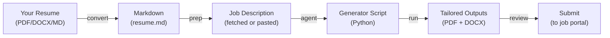

# ResumeTailor — Generic Resume Tailoring Tool

A complete, shareable toolkit for tailoring resumes to specific job descriptions. Works with any candidate's background and resume format (PDF, DOCX, Markdown).

**Perfect for:** Individual job applications, career coaches, recruiters, or anyone helping others tailor resumes efficiently.

---

## 📋 What's Included

```
resumeTailor/
├── README.md                          # This file
├── bin/
│   ├── tailor_resume_generic.sh       # Main prep script (fetches JD, prepares workspace)
│   └── convert_resume_to_md.py        # Converts PDF/DOCX → Markdown
├── agents/
│   └── resume-tailor-generic.md       # Wibey AI agent (generates tailored scripts)
├── docs/
│   ├── TAILORING_RULES.md             # Rules enforced during tailoring
│   ├── USAGE_GUIDE.md                 # Detailed usage documentation
│   └── CONVERT_GUIDE.md               # Resume conversion guide (PDF/DOCX → MD)
└── companies/
    ├── Acme/                          # Auto-created per company
    │   ├── Acme_jd.md                 # Job description
    │   ├── Acme_interview_prep.pdf     # Interview prep guide
    │   ├── generate_resume_acme.py    # Generator script (from agent)
    │   ├── YourName_Acme.pdf          # Tailored resume (output)
    │   └── YourName_Acme.docx  # DOCX for portals (output)
    └── ...
```

---

## 🚀 Quick Start (10 Minutes)

> ⭐ **First time?** Read [TAILORING_RULES.md](docs/TAILORING_RULES.md) to understand what the agent will enforce. Takes 5 minutes and saves back-and-forth.

### 1. Install Dependencies

```bash
# For PDF support (recommended)
pip install pdfplumber

# For DOCX support
pip install python-docx

# For Wibey AI agent (already in Claude Code / JetBrains)
```

### 2. Convert Your Resume (if PDF/DOCX)

```bash
cd resumeTailor
python3 bin/convert_resume_to_md.py ~/your-resume.pdf

# Output: ~/your-resume.md
```

### 3. Prepare for Job (Auto-saves to `./companies/<Company>/`)

```bash
cd resumeTailor

./bin/tailor_resume_generic.sh \
  --base-resume ~/your-resume.md \
  --candidate-name "Your Name" \
  https://jobs.lever.co/company/job-123
```

**This creates:**
- `companies/Company/Company_jd.md` — Job description
- `companies/Company/Company_interview_prep.pdf` — Interview prep template
- `companies/Company/tailoring_info.txt` — Metadata

### 4. Generate Tailored Resume (Using Wibey Agent)

In Claude Code or Wibey:
```
Tailor my resume for Company

Read the JD from: companies/Company/Company_jd.md
Base resume: ~/your-resume.md
```

The agent generates: `generate_resume_company.py`

### 5. Run Generator & Get Outputs

```bash
cd companies/Company/
python3 generate_resume_company.py

# Creates:
#   - YourName_Company.pdf
#   - YourName_Company.docx
```

### 6. Review & Prepare for Interview

- Edit `Company_interview_prep.pdf` with company-specific research
- Review both PDF and DOCX files
- Practice your stories and questions

---

## 📖 Complete Workflow



---

## 🔧 Available Tools

### 1. **tailor_resume_generic.sh** — Prep & Setup

**Purpose:** Fetch job descriptions, prepare workspace, generate interview prep template

```bash
./bin/tailor_resume_generic.sh \
  --base-resume <path>              # Your comprehensive resume (required)
  --candidate-name <name>           # Your full name (required)
  [--output-dir <path>]             # Optional: where to save outputs (default: ./companies)
  [--validator <path>]              # Optional: custom validator
  [--force]                         # Optional: skip match score gate
  [--skip-interview-prep]           # Optional: don't generate interview prep
  https://job-url
```

**Outputs (in `./companies/<Company>/`):**
- `<Company>_jd.md` — Job description (fetched or pasted)
- `<Company>_interview_prep.pdf` — Interview prep template (customizable)
- `tailoring_info.txt` — Metadata and next steps
- Ready for generator script and PDF/DOCX outputs

### 2. **convert_resume_to_md.py** — Format Conversion

**Purpose:** Convert existing PDF/DOCX resumes to Markdown

```bash
python3 bin/convert_resume_to_md.py <input.pdf|input.docx> [output.md]

# Examples:
python3 bin/convert_resume_to_md.py ~/resume.pdf
python3 bin/convert_resume_to_md.py ~/resume.docx ~/my-resume.md
python3 bin/convert_resume_to_md.py ~/resume.pdf --interactive
```

**Features:**
- Auto-detects file format (PDF or DOCX)
- Parses resume structure (name, skills, experience, education, etc.)
- Converts to clean Markdown
- Optional interactive review mode

### 3. **resume-tailor-generic.md** — AI Agent

**Purpose:** Analyze JD + resume → generate tailored Python script

**Trigger phrases:**
- "Tailor my resume for {Company}"
- "Create tailored resume for {JD}"
- "Generate resume script for {role}"

**What it does:**
1. Reads your comprehensive resume
2. Analyzes job description
3. Selects relevant bullets (reorders by JD relevance)
4. Writes a Python generator script
5. (Optional) Validates against custom rules
6. Produces tailored PDF + DOCX

---

## 📚 Documentation

| Document | Purpose |
|----------|---------|
| **TAILORING_RULES.md** | ⭐ **READ FIRST** — Rules enforced during tailoring (content, ATS, validation) |
| **USAGE_GUIDE.md** | Complete workflow, advanced options, troubleshooting |
| **CONVERT_GUIDE.md** | Step-by-step resume conversion (PDF/DOCX → Markdown) |

---

## 💡 Common Workflows

### Workflow A: Start with PDF Resume

```bash
cd resumeTailor

# 1. Convert PDF to Markdown
python3 bin/convert_resume_to_md.py ~/resume.pdf

# 2. Review and edit ~/resume.md (fix any parsing issues)
vim ~/resume.md

# 3. Prepare for tailoring (auto-saves to ./companies/Company/)
./bin/tailor_resume_generic.sh \
  --base-resume ~/resume.md \
  --candidate-name "Jane Smith" \
  https://jobs.lever.co/company/job-123

# 4. Use Wibey agent to generate tailored script
# (In Claude Code: "Tailor my resume for Company...")

# 5. Run the generated script
cd companies/Company/
python3 generate_resume_company.py
```

### Workflow B: Start with Markdown Resume

```bash
cd resumeTailor

# 1. Prepare for tailoring (auto-saves to ./companies/Company/)
./bin/tailor_resume_generic.sh \
  --base-resume ~/my-resume.md \
  --candidate-name "John Doe" \
  https://boards.greenhouse.io/company/jobs/1234567

# 2. Use Wibey agent
# (In Claude Code: "Tailor my resume for Company...")

# 3. Run the generated script
cd companies/Company/
python3 generate_resume_company.py
```

### Workflow C: Multiple Jobs (Batch Tailoring)

```bash
cd resumeTailor

# Convert once
python3 bin/convert_resume_to_md.py ~/resume.pdf

# Tailor for each company (auto-saves to ./companies/{Company}/)
for url in "$JOB_URLS"; do
  ./bin/tailor_resume_generic.sh \
    --base-resume ~/resume.md \
    --candidate-name "Jane Smith" \
    "$url"
  # Then use agent for each...
done

# View all companies
ls -la companies/
```

---

## ⚙️ Installation & Setup

### System Requirements

- **Python 3.7+**
- **Bash** (for scripts)
- **Wibey** or **Claude Code** (for AI agent; optional for manual workflow)

### Install Dependencies

**Core (required for all workflows):**
```bash
pip install pdfplumber python-docx pypdf reportlab
```

**For API-based generation (choose based on your provider):**

**Anthropic/Claude:**
```bash
pip install anthropic
```

**OpenAI/GPT:**
```bash
pip install openai
```

**Both (if using multiple providers):**
```bash
pip install anthropic openai
```

### Verify Installation

```bash
python3 -c "import pdfplumber; print('✓ pdfplumber')"
python3 -c "import docx; print('✓ python-docx')"
python3 -c "import anthropic; print('✓ anthropic')"  # If using Claude API
python3 -c "import openai; print('✓ openai')"        # If using OpenAI API
```

---

## 📝 Input Resume Format (Markdown)

Your comprehensive resume should be a clean Markdown file:

```markdown
# Jane Smith

**Email:** jane@example.com | **Phone:** (555) 123-4567 | **LinkedIn:** linkedin.com/in/jane | **Location:** San Francisco, CA

## Summary
Experienced Software Engineer with 10+ years building scalable systems...

## Skills
- **Languages:** Python, Java, Go, SQL
- **Cloud:** AWS (EC2, S3), Kubernetes, Docker
- **Data:** Kafka, PostgreSQL, Redis

## Experience

### Senior Engineer — Acme Corp (January 2020 - Present)
- Built distributed system handling 500K requests/second
- Led team of 5 engineers; mentored 2 who earned promotions
- Reduced deployment time from 45 min to 5 min via CI/CD

### Software Engineer — TechCorp (2018 - 2020)
- Implemented real-time data pipeline (Kafka + Elasticsearch)
- Improved API latency by 60% through caching optimization

## Education
- MS, Computer Science — University of California (2018)
- BS, Engineering — State University (2016)

## Certifications
- Kubernetes Administrator (CKAD), Linux Foundation (2021)
- AWS Solutions Architect, Amazon (2020)
```

---

## 📊 Output Files

After running the generator script, you get:

| File | Format | Use Case |
|------|--------|----------|
| `YourName_Company.pdf` | PDF | Email to recruiter, print-friendly |
| `YourName_Company.docx` | DOCX | Online job portals (ATS-friendly) |
| `generate_resume_company.py` | Python | Regenerate if you need to tweak |

All files are exactly **2 pages** (hard constraint for ATS scanning).

---

## 🎯 Best Practices

### Before Tailoring

- ✅ Ensure comprehensive resume is complete (all roles, skills, dates)
- ✅ Use clear section headings (Summary, Skills, Experience, Education)
- ✅ Include action verbs in bullets ("Built", "Led", "Designed", "Optimized")
- ✅ Add quantifiable impact where possible ("improved by 60%", "handled 500K events/sec")

### During Tailoring

- ✅ Reorder bullets by **JD relevance** (most relevant first, not chronological)
- ✅ For Staff/Senior roles: architecture + leadership bullets first
- ✅ Keep **18-22 bullets total** across all roles (2-page constraint)
- ✅ Remove old/niche skills not mentioned in JD

### After Generation

- ✅ Review both PDF and DOCX for accuracy
- ✅ Verify page count is exactly 2
- ✅ Check for formatting issues (strange characters, line breaks)
- ✅ Test PDF in different readers (browser, Acrobat, etc.)

---

## 🐛 Troubleshooting

### Issue: "pdfplumber not installed"

```bash
pip install pdfplumber
```

### Issue: Resume conversion is incomplete or messy

**Solution:** Open the generated `.md` file and manually fix:
- Add section headers if missing
- Reformat bullets with proper dashes (`-`)
- Fix date ranges (`Month Year - Month Year`)
- Remove artifacts from PDF extraction

See **CONVERT_GUIDE.md** for detailed fixes.

### Issue: Job URL won't fetch

**Solution:** The script will prompt you to paste the JD manually. Copy from the job posting and paste when prompted.

### Issue: Agent won't generate the script

**Solution:**
1. Provide both resume AND job description to the agent
2. Confirm candidate name and company name
3. If stuck, ask the agent to explain what's missing

### Issue: Generated resume doesn't fit 2 pages

**Solution:**
- Reduce bullet count (start with 4-6 per role, not 8-10)
- Shorten bullet descriptions
- Remove niche/less relevant bullets
- The agent can help trim via conversation

---

## 🔐 Privacy & Security

- ✅ All processing is local (no data sent to external services except job URL fetch)
- ✅ Markdown files are plain text (version control friendly, easy to audit)
- ✅ No credentials or secrets stored in scripts
- ✅ Safe to share with teammates or use in shared environments

---

## 📦 Sharing This Tool

### Package for Distribution

```bash
cd ..
tar -czf resumeTailor.tar.gz resumeTailor/
# or
zip -r resumeTailor.zip resumeTailor/
```

### Share with Team

1. Email the archive
2. Put in shared Git repo
3. Add to internal documentation/wiki
4. Include this README for quick onboarding

### What Each User Needs

Each person using the tool should:
1. Extract the archive
2. Create their own `my-resume.md` (or convert from PDF/DOCX)
3. Run the prep script with their details
4. Use the agent to generate tailored scripts
5. Review and submit outputs

---

## 🔗 Integrations

### With Wibey/Claude Code

The **resume-tailor-generic.md** agent is designed to work seamlessly in Wibey or Claude Code:

1. Place `agents/resume-tailor-generic.md` in `~/.wibey/agents/` (or project `.wibey/agents/`)
2. Trigger with natural language: "Tailor my resume for {Company}"
3. Agent handles the rest

### With Custom CI/CD

You can automate resume generation in CI/CD pipelines:

```bash
# Example: generate all resumes
for company in "Acme" "TechCorp" "StartupXYZ"; do
  python3 tailor_resume_generic.sh \
    --base-resume resume.md \
    --candidate-name "Your Name" \
    --output-dir ./resumes \
    "$COMPANY_JOB_URL"
done
```

---

## 📞 Support & Feedback

### Common Questions

**Q: Can I use this for multiple candidates?**
A: Yes! Each candidate just needs their own resume.md file. Scripts are fully generic.

**Q: Can I customize validation rules?**
A: Yes! Pass `--validator /path/to/custom_validator.py` to the prep script. Agent will validate against your rules.

**Q: What if my resume is very long?**
A: The 2-page limit is hard. Trim aggressively: keep 18-22 bullets total, prioritize recency and JD relevance.

**Q: Can I use this without the AI agent?**
A: Yes, but you'd manually create the Python generator script (more work). Agent is highly recommended.

---

## 📄 License

These tools are provided as-is. Feel free to:
- ✅ Use for personal resume tailoring
- ✅ Share with friends and colleagues
- ✅ Modify for your specific needs
- ✅ Integrate into larger workflows

No attribution required, but appreciated!

---

## 🎉 Ready to Start?

1. **Ensure dependencies are installed:**
   ```bash
   pip install pdfplumber python-docx
   ```

2. **Check that scripts are executable:**
   ```bash
   chmod +x bin/*.sh bin/*.py
   ```

3. **Follow the quick start above**, or read:
   - **USAGE_GUIDE.md** — for detailed workflows
   - **CONVERT_GUIDE.md** — for PDF/DOCX conversion

4. **Questions?** Open an issue or ask the AI agent for help.

---

**Happy tailoring! 📄✨**

Last updated: August 17, 2026
