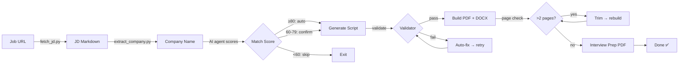

# ResumeTailor — Generic Resume Tailoring Tool

A complete, shareable toolkit for tailoring resumes to specific job descriptions. Works with any candidate's background and resume format (PDF, DOCX, Markdown). Supports multiple AI agents: Wibey, OpenAI, Claude API, and OpenRouter.

**Perfect for:** Individual job applications, career coaches, recruiters, or anyone helping others tailor resumes efficiently.

---

## 📋 What's Included

```
resumeTailor/
├── README.md                          # This file
├── LICENSE                            # License
├── CONTRIBUTING.md                    # Contribution guidelines
├── CODE_REVIEW.md                     # Code review notes
├── COMPLETION_STATUS.md               # Feature completion tracking
├── GENERIC_SCRIPT_GUIDE.md            # Guide for generator scripts
├── bin/
│   ├── tailor_resume_generic.sh       # Main pipeline (end-to-end)
│   ├── generate_with_agent.py         # Multi-agent wrapper (OpenAI/Claude/OpenRouter)
│   ├── generate_resume_script.py      # Claude API script generator (standalone)
│   ├── fetch_jd.py                    # Job description fetcher (URL → Markdown)
│   ├── extract_company.py             # Company name extractor (from JD or URL)
│   ├── convert_resume_to_md.py        # Converts PDF/DOCX → Markdown
│   ├── resume_validator.py            # Validates generated resume scripts
│   ├── render_table.py                # Match score table renderer
│   └── generate_prep_pdf.py           # Interview prep PDF generator
├── agents/
│   └── resume-tailor-generic.md       # AI agent instructions (Wibey / generic)
├── docs/
│   ├── TAILORING_RULES.md             # Rules enforced during tailoring
│   ├── USAGE_GUIDE.md                 # Detailed usage documentation
│   ├── CONVERT_GUIDE.md               # Resume conversion guide (PDF/DOCX → MD)
│   ├── MULTI_AGENT_GUIDE.md           # Guide for using different AI providers
│   └── AGENT_SETUP.md                 # Agent setup and configuration
└── companies/
    └── <Company>/                     # Auto-created per company
        ├── <Company>_jd.md            # Job description
        ├── <Company>_interview_prep.pdf # Interview prep guide
        ├── generate_resume_<company>.py # Generator script (from agent)
        ├── <Name>_<Company>.pdf       # Tailored resume PDF
        └── <Name>_<Company>.docx      # Tailored resume DOCX
```

---

## 🚀 Quick Start

> ⭐ **First time?** Read [TAILORING_RULES.md](docs/TAILORING_RULES.md) to understand what the agent enforces.

### 1. Set Up Virtual Environment

```bash
cd resumeTailor
python3 -m venv .venv
source .venv/bin/activate

# Core dependencies (required for all workflows)
pip install pdfplumber python-docx pypdf fpdf2

# For API-based agents (install the one(s) you'll use)
pip install openai       # For OpenAI (GPT-4o, etc.)
pip install anthropic    # For Claude API
pip install requests     # For OpenRouter
```

> **Note:** `tailor_resume_generic.sh` auto-detects the `.venv/` directory in the repo root. You don't need to activate the venv before running the script — it finds and uses the venv Python automatically. If you have an activated venv (`$VIRTUAL_ENV` set), that takes priority.

### 2. Convert Your Resume (if PDF/DOCX)

```bash
python3 bin/convert_resume_to_md.py ~/your-resume.pdf
# Output: ~/your-resume.md
```

### 3. Run the Pipeline

The main script handles everything end-to-end: fetch JD → score match → generate script → validate → build PDF/DOCX → interview prep.

**With Wibey (default):**

```bash
./bin/tailor_resume_generic.sh \
  --base-resume ~/your-resume.md \
  https://linkedin.com/jobs/view/1234567
```

**With OpenAI:**

```bash
./bin/tailor_resume_generic.sh \
  --base-resume ~/your-resume.md \
  --agent openai \
  --api-key sk-xxxx \
  --model gpt-4o \
  https://linkedin.com/jobs/view/1234567
```

**With Claude API:**

```bash
./bin/tailor_resume_generic.sh \
  --base-resume ~/your-resume.md \
  --agent claude \
  --api-key sk-ant-xxxx \
  --model claude-sonnet-4-20250514 \
  https://linkedin.com/jobs/view/1234567
```

**With OpenRouter:**

```bash
./bin/tailor_resume_generic.sh \
  --base-resume ~/your-resume.md \
  --agent openrouter \
  --api-key sk-or-xxxx \
  --model anthropic/claude-sonnet-4 \
  https://linkedin.com/jobs/view/1234567
```

The script will:
1. Fetch the job description (or prompt you to paste it)
2. Auto-detect the company name (or ask you to confirm)
3. Score the JD match (with a table of matches/gaps)
4. Generate the resume script via the selected agent
5. Validate the script (if `resume_validator.py` is available)
6. Build the PDF and DOCX files
7. Auto-trim to 2 pages if needed
8. Generate an interview prep PDF

### 4. Review & Submit

All outputs land in `./companies/<Company>/`:

```bash
ls companies/Acme/
# Acme_jd.md
# Acme_interview_prep.pdf
# generate_resume_acme.py
# YourName_Acme.pdf
# YourName_Acme.docx
```

---

## 📖 End-to-End Pipeline



---

## 🔧 CLI Reference

### tailor_resume_generic.sh

```
Usage: tailor_resume_generic.sh <job-url> [CompanyName] [options]

Required:
  <job-url>                Job posting URL
  --base-resume <path>     Path to comprehensive resume markdown

Optional:
  [CompanyName]            Company name (auto-detected if omitted)
  --candidate-name <name>  Candidate name (extracted from resume H1 if omitted)
  --output-dir <dir>       Output directory (default: ./companies)
  --force                  Skip JD match score gate and generate anyway
  --agent <type>           wibey (default), openai, claude, openrouter
  --api-key <key>          API key (required for openai, claude, openrouter)
  --model <model>          Model name (required for openai, claude, openrouter)
```

### Agent Comparison

| Agent | Requires | Best For |
|-------|----------|----------|
| `wibey` | Wibey CLI installed | Default — reads files directly, uses Wibey agent |
| `openai` | `--api-key`, `--model` | GPT-4o, GPT-4-turbo |
| `claude` | `--api-key`, `--model` | Claude Sonnet/Opus via Anthropic API |
| `openrouter` | `--api-key`, `--model` | Any model via OpenRouter (Claude, GPT, Llama, etc.) |

**Recommended models:**

| Agent | Model | Notes |
|-------|-------|-------|
| openai | `gpt-4o` | Fast, high rate limits, cost-effective |
| claude | `claude-sonnet-4-20250514` | Strong code generation |
| openrouter | `anthropic/claude-sonnet-4` | Access Claude without Anthropic API key |

> ⚠️ Avoid `gpt-4` (original) — its 10K TPM rate limit is too low for the prompt size.

---

## 🔧 Other Tools

### convert_resume_to_md.py — Format Conversion

```bash
python3 bin/convert_resume_to_md.py <input.pdf|input.docx> [output.md]
python3 bin/convert_resume_to_md.py ~/resume.pdf --interactive
```

### generate_with_agent.py — Multi-Agent Wrapper (Standalone)

```bash
python3 bin/generate_with_agent.py \
  --agent openai \
  --api-key sk-xxxx \
  --model gpt-4o \
  --jd companies/Acme/Acme_jd.md \
  --resume ~/resume.md \
  --company Acme \
  --candidate-name "Jane Smith" \
  --output-dir companies/Acme/
```

### generate_resume_script.py — Claude API Generator (Standalone)

```bash
python3 bin/generate_resume_script.py \
  --comprehensive ~/resume.md \
  --jd companies/Acme/Acme_jd.md \
  --candidate "Jane Smith" \
  --company Acme \
  --output companies/Acme/generate_resume_acme.py \
  --api-key sk-ant-xxxx \
  --model claude-sonnet-4-20250514
```

### resume_validator.py — Validate Generator Scripts

```bash
python3 bin/resume_validator.py companies/Acme/generate_resume_acme.py
```

### resume-tailor-generic.md — AI Agent

**Trigger phrases (in Wibey / Claude Code):**
- "Tailor my resume for {Company}"
- "Create tailored resume for {JD}"
- "Generate resume script for {role}"

---

## ⚙️ Installation & Setup

### System Requirements

- **Python 3.7+**
- **Bash** (for the main pipeline script)
- One of: Wibey, OpenAI API key, Anthropic API key, or OpenRouter API key

### Install All Dependencies

```bash
cd resumeTailor
python3 -m venv .venv
source .venv/bin/activate

# Core (required for all workflows)
pip install pdfplumber python-docx pypdf fpdf2

# API agents (pick one or more based on your provider)
pip install openai       # OpenAI
pip install anthropic    # Claude API
pip install requests     # OpenRouter
```

### Verify Installation

```bash
source .venv/bin/activate
python3 -c "import pdfplumber; print('✓ pdfplumber')"
python3 -c "import docx; print('✓ python-docx')"
python3 -c "import fpdf; print('✓ fpdf2')"
python3 -c "import pypdf; print('✓ pypdf')"
python3 -c "import openai; print('✓ openai')"       # If using OpenAI
python3 -c "import anthropic; print('✓ anthropic')"  # If using Claude API
```

> **Important:** All four core packages (`pdfplumber`, `python-docx`, `pypdf`, `fpdf2`) must be installed in the same venv. The pipeline script auto-detects `.venv/` in the repo root — you don't need to activate the venv before running `tailor_resume_generic.sh`.

---

## 📚 Documentation

| Document | Purpose |
|----------|---------|
| [TAILORING_RULES.md](docs/TAILORING_RULES.md) | ⭐ **Read first** — Content rules, ATS rules, validation |
| [USAGE_GUIDE.md](docs/USAGE_GUIDE.md) | Complete workflow, advanced options, troubleshooting |
| [MULTI_AGENT_GUIDE.md](docs/MULTI_AGENT_GUIDE.md) | Using OpenAI, Claude, OpenRouter agents |
| [AGENT_SETUP.md](docs/AGENT_SETUP.md) | Agent configuration and API key setup |
| [CONVERT_GUIDE.md](docs/CONVERT_GUIDE.md) | PDF/DOCX → Markdown conversion guide |
| [GENERIC_SCRIPT_GUIDE.md](GENERIC_SCRIPT_GUIDE.md) | How generator scripts work |

---

## 💡 Common Workflows

### Workflow A: Start with PDF Resume

```bash
cd resumeTailor
source .venv/bin/activate

# 1. Convert PDF to Markdown
python3 bin/convert_resume_to_md.py ~/resume.pdf

# 2. Review and edit
vim ~/resume.md

# 3. Run end-to-end pipeline
./bin/tailor_resume_generic.sh \
  --base-resume ~/resume.md \
  --agent openai --api-key sk-xxxx --model gpt-4o \
  https://linkedin.com/jobs/view/1234567

# Done — PDF, DOCX, and interview prep in companies/<Company>/
```

### Workflow B: Batch Multiple Jobs

```bash
cd resumeTailor
source .venv/bin/activate

for url in \
  "https://linkedin.com/jobs/view/111" \
  "https://linkedin.com/jobs/view/222" \
  "https://linkedin.com/jobs/view/333"; do
  ./bin/tailor_resume_generic.sh \
    --base-resume ~/resume.md \
    --agent openai --api-key sk-xxxx --model gpt-4o \
    "$url"
done

ls companies/
```

---

## 📊 Output Files

| File | Format | Use Case |
|------|--------|----------|
| `<Name>_<Company>.pdf` | PDF | Email to recruiter, print-friendly |
| `<Name>_<Company>.docx` | DOCX | Online job portals (ATS-friendly) |
| `generate_resume_<company>.py` | Python | Regenerate or tweak bullets |
| `<Company>_jd.md` | Markdown | Job description for reference |
| `<Company>_interview_prep.pdf` | PDF | Company research + interview questions |

All resumes are exactly **2 pages** (hard constraint for ATS scanning).

---

## 📝 Input Resume Format (Markdown)

Your comprehensive resume should be a clean Markdown file:

```markdown
# Jane Smith

**Email:** jane@example.com | **Phone:** (555) 123-4567 | **Location:** San Francisco, CA

## Summary
Experienced Software Engineer with 10+ years building scalable systems...

## Skills
- **Languages:** Python, Java, Go, SQL
- **Cloud:** AWS (EC2, S3), Kubernetes, Docker

## Experience

### Senior Engineer — Acme Corp (January 2020 - Present)
- Built distributed system handling high-throughput traffic
- Led team of engineers; mentored juniors who earned promotions
- Reduced deployment time via CI/CD pipeline optimization

### Software Engineer — TechCorp (June 2018 - December 2019)
- Implemented real-time data pipeline (Kafka + Elasticsearch)
- Improved API latency through caching optimization

## Education
- MS, Computer Science — University of California (2018)
- BS, Engineering — State University (2016)
```

---

## 🐛 Troubleshooting

### "No module named 'fpdf'"

```bash
source .venv/bin/activate
pip install fpdf2
```

### "Request too large" (OpenAI 429 error)

Use `gpt-4o` instead of `gpt-4`:
```bash
--model gpt-4o   # Higher rate limits, cheaper
```

### Job URL won't fetch

The script prompts you to paste the JD manually. Copy from the job posting and paste when prompted, then press Ctrl+D.

### Resume doesn't fit 2 pages

The pipeline auto-trims (up to 2 attempts). If it still exceeds 2 pages:
- Reduce bullet count (18-22 total max)
- Shorten bullet text
- Remove oldest/least relevant bullets

### Match score can't be generated

Check the raw output at `/tmp/last_score_output.txt`. Common causes:
- Invalid API key
- Wrong model name
- Network issues

---

## 🔐 Privacy & Security

- ✅ All processing is local (no data sent externally except API calls to your chosen provider)
- ✅ Markdown files are plain text (version control friendly)
- ✅ No credentials stored in scripts — pass API keys via `--api-key` flag
- ✅ `.venv/` is gitignored

---

## 📞 FAQ

**Q: Which agent should I use?**
A: Wibey if you have it installed. Otherwise `openai` with `gpt-4o` is the most reliable and cost-effective.

**Q: Can I use this for multiple candidates?**
A: Yes. Each candidate needs their own `resume.md`. Scripts are fully generic.

**Q: Can I re-run just the PDF generation?**
A: Yes — run the generator script directly:
```bash
cd companies/Acme && python3 generate_resume_acme.py
```

**Q: Can I use this without any AI agent?**
A: Yes, but you'd manually write the Python generator script. The agent automates this step.

---

## 📄 License

See [LICENSE](LICENSE).

---

Last updated: August 20, 2026
